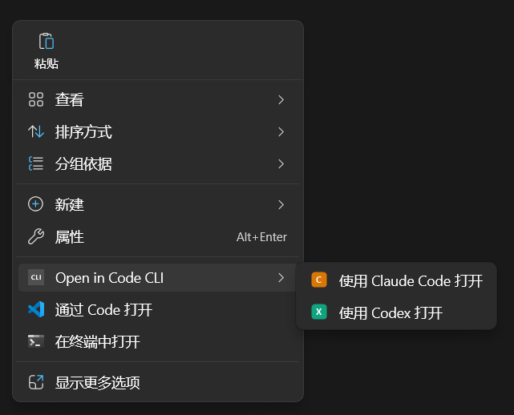

# Open in Code CLI

在 Windows 11 的**新版右键菜单**中添加「使用 Claude Code 打开」和「使用 Codex 打开」两个菜单项，带有自定义图标。




## 效果

右键点击文件夹或文件夹空白处，在 Windows 11 新版右键菜单中直接显示：

| 菜单项 | 图标 | 行为 |
|--------|------|------|
| **使用 Claude Code 打开** | 橙色 C | 在 Windows Terminal 中打开目录并运行 `claude` |
| **使用 Codex 打开** | 绿色 X | 在 Windows Terminal 中通过 WSL 运行 `codex` |

## 前置要求

- **Windows 11**（或 Windows Server 2025）
- **Windows Terminal**（`wt.exe`）
- **Visual Studio Build Tools 2022**（需要 MSVC C++ 编译器）
- **Windows SDK**（10.0.19041.0 或更高，需要 `makeappx.exe` 和 `signtool.exe`）
- **Claude Code**（`claude` 命令已在 PATH 中）
- **Codex + WSL**（如需使用 Codex 菜单项）

### 安装 Build Tools（如果尚未安装）

```powershell
winget install Microsoft.VisualStudio.2022.BuildTools --override "--add Microsoft.VisualStudio.Workload.VCTools --includeRecommended --quiet"
```

Windows SDK 通常已包含在 Build Tools 中。如需单独安装：

```powershell
winget install Microsoft.WindowsSDK.10.0.26100
```

## 快速开始

```powershell
git clone https://github.com/Yuerchu/open-in-code-cli.git
cd open-in-code-cli

# 1. 编译 DLL
.\build.bat

# 2. 一键安装（自动请求管理员权限）
powershell -ExecutionPolicy Bypass -File install.ps1
```

安装脚本会自动完成以下步骤：

1. 编译 COM DLL（如果 `dist/` 中不存在）
2. 生成图标文件（如果不存在）
3. 创建自签名证书并添加到本机信任存储
4. 打包为 MSIX Sparse Package 并签名
5. 安装 MSIX 包
6. 重启资源管理器

## 卸载

```powershell
powershell -ExecutionPolicy Bypass -File uninstall.ps1
```

## 手动构建

```powershell
# 编译 DLL 和 stub.exe → 输出到 dist/
.\build.bat

# 生成图标文件 → dist/claude.ico, dist/codex.ico
powershell -ExecutionPolicy Bypass -File create_icons.ps1

# 安装
powershell -ExecutionPolicy Bypass -File install.ps1
```

## 项目结构

```
open-in-code-cli/
├── src/
│   ├── context_menu.cpp    # IExplorerCommand COM DLL 源码（两个命令）
│   ├── context_menu.def    # DLL 导出定义
│   └── stub.c              # 空壳 EXE（AppxManifest 必需）
├── dist/                   # 构建输出（git ignored）
│   ├── AppxManifest.xml    # MSIX Sparse Package 清单
│   ├── context_menu.dll    # COM Shell Extension
│   ├── stub.exe
│   ├── claude.ico / codex.ico
│   └── assets/             # 包 Logo
├── build.bat               # MSVC 编译脚本
├── create_icons.ps1        # 图标生成（System.Drawing）
├── install.ps1             # 一键安装
└── uninstall.ps1           # 一键卸载
```

## 技术原理

Windows 11 的新版右键菜单不再加载传统的注册表 Shell 扩展，而要求：

1. **实现 `IExplorerCommand` COM 接口**的 DLL
2. 通过 **MSIX Sparse Package** 获得「包标识」（Package Identity）
3. 在 `AppxManifest.xml` 中用 `desktop5:FileExplorerContextMenus` 声明目录上下文菜单

本项目参考了 [VS Code 的实现](https://github.com/microsoft/vscode-explorer-command)，使用 WRL（Windows Runtime Library）实现 COM 类注册。

### 为什么 MSIX 不能直接拷贝到其他电脑安装？

MSIX 使用**自签名证书**签名。每台机器安装时 `install.ps1` 会在本地生成新的证书并信任。直接拷贝 `.msix` 文件到其他电脑会因证书不受信任而失败。

**正确的分发方式：** 在目标机器上 clone 仓库并运行 `install.ps1`，脚本会自动完成编译、签名和安装。

如果需要免编译分发，可以将 `dist/` 目录和项目根目录的脚本一起打包，在目标机器上运行 `install.ps1`（仍需要 Windows SDK 来打包和签名）。

## 自定义

### 修改菜单文字

编辑 `src/context_menu.cpp` 中的 `GetTitle` 方法，Unicode 转义字符对应中文：

```cpp
// "使用 Claude Code 打开"
return SHStrDupW(L"\x4F7F\x7528 Claude Code \x6253\x5F00", name);
```

### 修改图标

替换 `dist/claude.ico` 和 `dist/codex.ico`，或编辑 `create_icons.ps1` 中的颜色和文字。

### 修改启动命令

编辑 `src/context_menu.cpp` 中各 `Invoke` 方法：

- Claude: `wt.exe -d "{path}" -- claude`
- Codex: `wt.exe -- wsl --cd "{path}" bash -lic codex`

修改后需重新运行 `build.bat` 和 `install.ps1`。

## License

MIT
